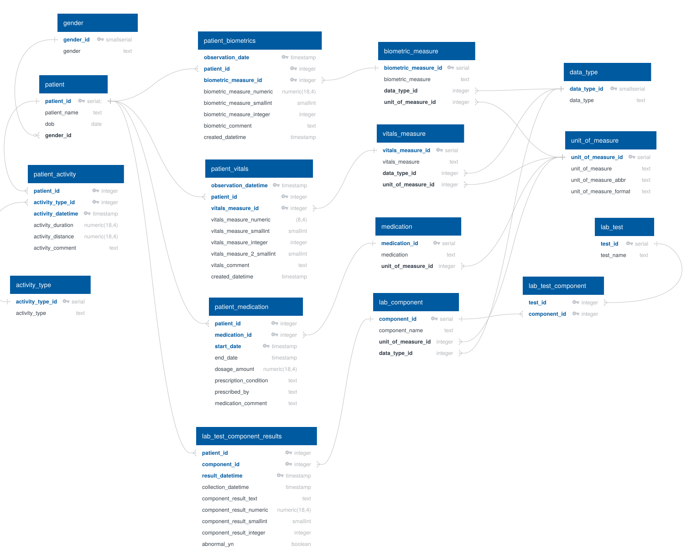

# Health Hub

Track a patient's health stats over time — weight, vitals, lab results, medications, and more — all in one place. Built on a PostgreSQL database, Python Flask backend, and a jQuery / DataTables front end.

### Data Model

  

### Screenshots
_TBD — once the UI is built out._

### Tools Needed to Create
|Tool   |Description                                                                                                          |
|-------|---------------------------------------------------------------------------------------------------------------------|
|PostgreSQL|Free relational database. [PostgreSQL](https://www.postgresql.org/)|
|Python|Flask + Waitress to serve the app; psycopg2 / SQLAlchemy for DB access|
|jQuery / DataTables|Front-end table rendering, filtering, and export ([DataTables](https://datatables.net/))|
|Bootstrap|UI styling|
|Plotly|Charts for trending lab values, weight, etc.|

### Steps to Create
|Step #|            |                                                                                                           |
|---|------------|-----------------------------------------------------------------------------------------------------------|
|1  |Install prerequisites|Run `install_prereqs.bat` to install PostgreSQL, Python, Git, and the GitHub CLI|
|2  |Setup PostgreSQL DB|Create a database called `health_db`|
|3  |Run sql script|Run the DDL script in `static/sql/` to create the tables (DB diagram pending)|
|4  |Configure connection|Add DB credentials / Flask secret to the app config|
|5  |Launch|Run `start_health_hub.bat` to start the Flask app via Waitress|

### Database
DDL lives in `static/sql/table_ddl.sql`; lookup seed data in `static/sql/seed_data.sql`. See the **Data Model** diagram above.

### Tracked Stats (planned)
- Weight / body composition
- Blood pressure, heart rate
- Lab results (CBC, lipid panel, A1c, etc.) with reference ranges
- Medications and dosages
- Visits and provider notes
